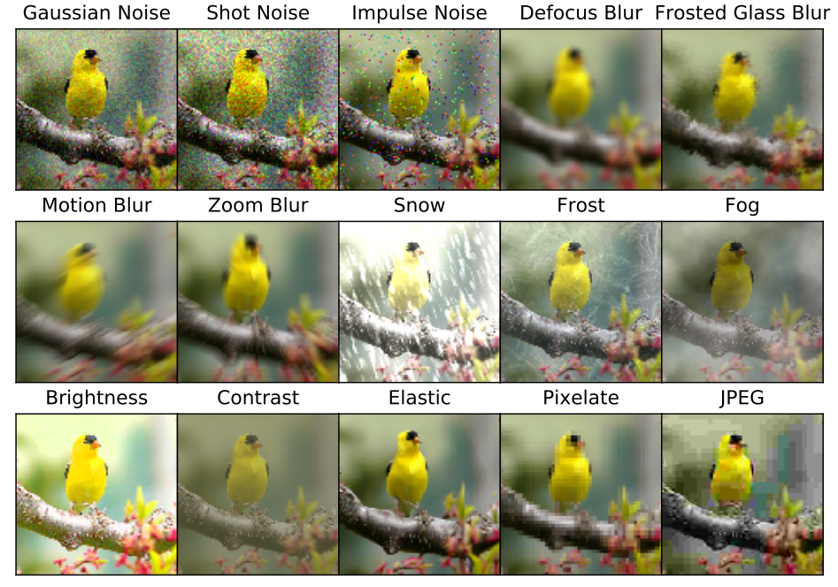
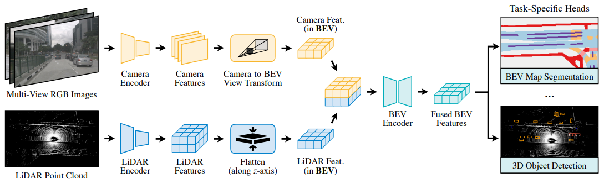
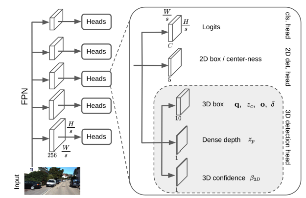
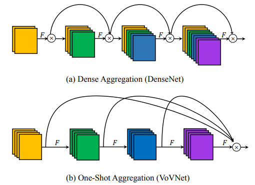
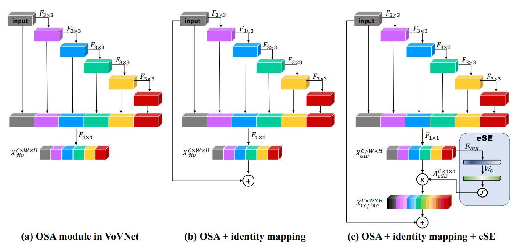

## 2023.2.19

##### The Many Faces of Robustness: A Critical Analysis of Out-of-Distribution Generalization \[[paper](https://openaccess.thecvf.com/content/ICCV2021/papers/Hendrycks_The_Many_Faces_of_Robustness_A_Critical_Analysis_of_Out-of-Distribution_ICCV_2021_paper.pdf)]

- Our results show that future research must study multiple distribution shifts simultaneously, as we demonstrate that no evaluated method consistently improves robustness.
-  ImageNet-C is a diverse and systematic benchmark that is correlated with improvements on real-world corruptions.

## 2023.2.20 

##### Benchmarking Neural Network Robustness to Common Corruptions and Pertubations \[[paper](https://arxiv.org/pdf/1903.12261.pdf)]

- corruption robustness measures the classifier’s average-case performance on corruptions C, while adversarial robustness measures the worst-case performance on small, additive, classifier-tailored perturbations.

## 2023.2.22

##### BEVFusion: Multi-Task Multi-Sensor Fusion with Unified Bird’s-Eye View Representation [[paper](https://arxiv.org/pdf/2205.13542.pdf)]

- Use Precomputation and Interval Reduction to largely reduce the inference speed during the PV2BEV transform.
- Use full convolutional to fuse futures from different modalities, which can overcome the local misalignment problem.
- Discuss robustness when one sensor fails: lowlight for the camera and rain for LiDAR respectively.

##### Is Pseudo-LiDAR needed for Monocular 3D Object detection? [[paper](https://arxiv.org/pdf/2108.06417.pdf)]

- The paper proposes an end-to-end single-stage monocular 3D detector that enjoys the benefits of pseudo-LiDAR (e.g., scale with large-scale depth estimation pre-train) while overcoming the limitations (e.g., generalization, impractical training).
- DD3D outperforms FCOS3D might mainly because FCOS3D is trained from the randomly initialized weight.

##### An Energy and GPU-Computation Efficient Backbone Network for Real-Time Object Detection [[paper]()]

- The main difference between ResNet and DenseNet is the way they aggregate their features: ResNet aggregates the features from shallower by summation while DenseNet does it by concatenation.
- The goal of this paper is to improve DenseNet to be more efficient while preserving the benefit from concatenative aggregation for object detection task.

##### CenterMask : Real-Time Anchor-Free Instance Segmentation [[paper](https://arxiv.org/pdf/1911.06667.pdf)]

- VoVNetV2 is improved from VoVNet by adding residual connection and the proposed effective Squeeze-and-Excitation (eSE) attention module to the VoVNet.